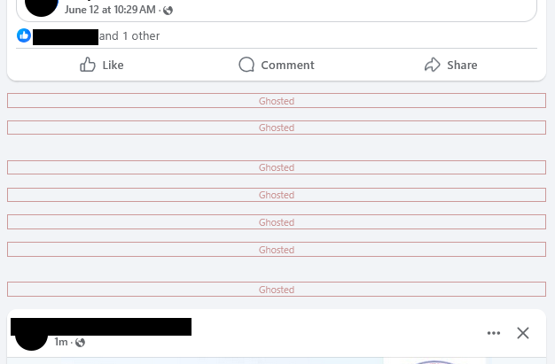

# Faceghost

Remove unsolicited posts from your Facebook timeline.

Screenshot:

## Installation

**Firefox:** https://addons.mozilla.org/en-US/firefox/addon/faceghost/

## Manual Installation

To install the extension manually, clone the faceghost repo and follow the instructions for your browser.

### Firefox
* Enter `about:debugging` in the address bar
* Click `This Firefox`
* Click `Load Temporary Add-on`
* Browse to your repo clone and select any file
* The extension will need to be reloaded if you close the browser

### Chrome
* In the menu, go to `Extensions` -> `Manage Extensions`
* Click `Load unpacked`
* Select your repo clone's folder

## TODO

* Publish for Google Chrome (pending)
